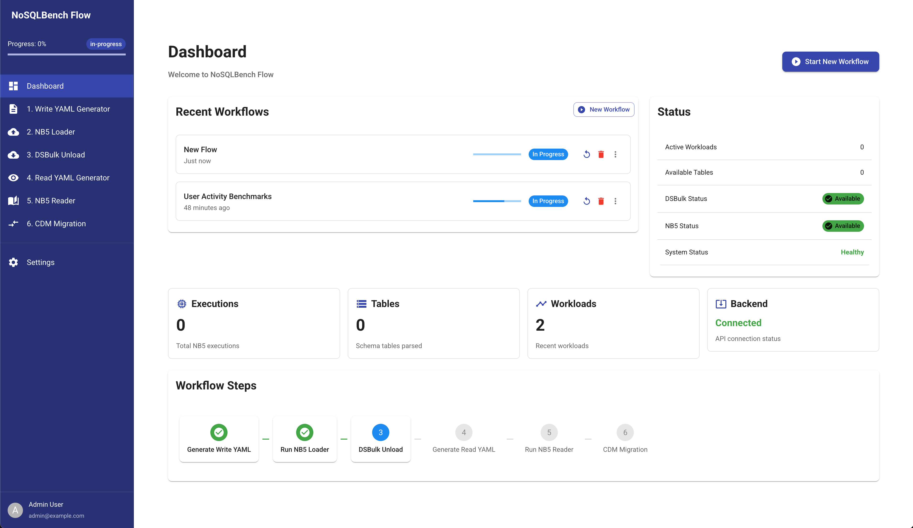

# NoSQLBench Flow

A web application for managing NoSQLBench workloads with Cassandra, combining schema parsing, YAML generation, data loading, and validation operations in a single interface.



## Features

- Parse Cassandra CQL schemas
- Generate NoSQLBench YAML files for write operations
- Run NoSQLBench data loading operations
- Export data using DSBulk
- Generate read YAML files for validation
- Run read operations to validate data consistency
- Prepare for CDM migration

## System Requirements

- Node.js (v14+)
- npm (v6+)
- Python (v3.8+)
- pip
- uvicorn

## Project Structure

```
nosqlbench-flow/
├── backend/          # FastAPI backend
│   ├── main.py       # Main API server
│   └── ...
└── frontend/         # React frontend
    ├── src/
    │   ├── components/  # Reusable UI components
    │   ├── context/     # Context providers
    │   ├── services/    # API services
    │   ├── views/       # Page components
    │   ├── App.jsx      # Main application component
    │   └── main.jsx     # Entry point
    └── ...
```

## Installation

You can use the included Makefile to easily install and run the application:

```bash
# Check if your system meets requirements
make check-reqs

# Install both frontend and backend dependencies
make setup

# Or install them separately
make setup-fe   # Frontend only
make setup-be   # Backend only
```

## Running the Application

To start both frontend and backend servers:

```bash
make start
```

This will start:
- Backend FastAPI server at http://localhost:8000
- Frontend development server at http://localhost:3000

You can also start them individually:

```bash
make start-fe   # Start frontend only
make start-be   # Start backend only
```

## Building for Production

To build the frontend for production:

```bash
make build
```

The output will be in the `frontend/dist` directory.

## Cleaning Up

To clean up node_modules, build artifacts, and Python cache files:

```bash
make clean
```

## Backend Configuration

The backend expects DSBulk and NoSQLBench JAR files to be available. By default, it looks for:

- DSBulk JAR at `~/workspace/dsbulk-1.11.0.jar`
- NoSQLBench JAR at `~/workspace/nb5.jar`

You can verify the status of these files in the Settings page of the application.

## API Endpoints

The backend provides several API endpoints:

- `/api/parse-schema` - Parse CQL schema files
- `/api/generate-yaml` - Generate NoSQLBench YAML files
- `/api/dsbulk/*` - DSBulk operations
- `/api/nb5/*` - NoSQLBench operations
- `/api/health` - Health check endpoint

## Development

The frontend proxy is configured to forward all `/api/*` requests to the backend server, so you don't need to worry about CORS issues during development.

## License

[MIT License](LICENSE)